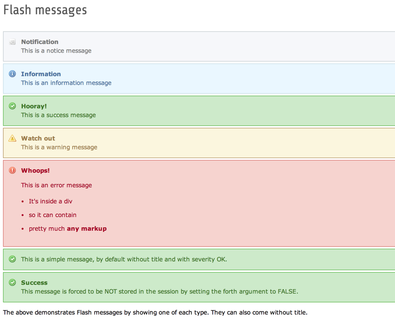

.. include:: /Includes.rst.txt
.. _demo-error-flash:

===================================
Demonstration von Flash-Nachrichten
===================================

Das BE-Modul der Erweiterung bietet einen Bildschirm für die Ausgabe von Flash Meldungen. Code-Extrakte werden in
Core-APIs verwendet.

