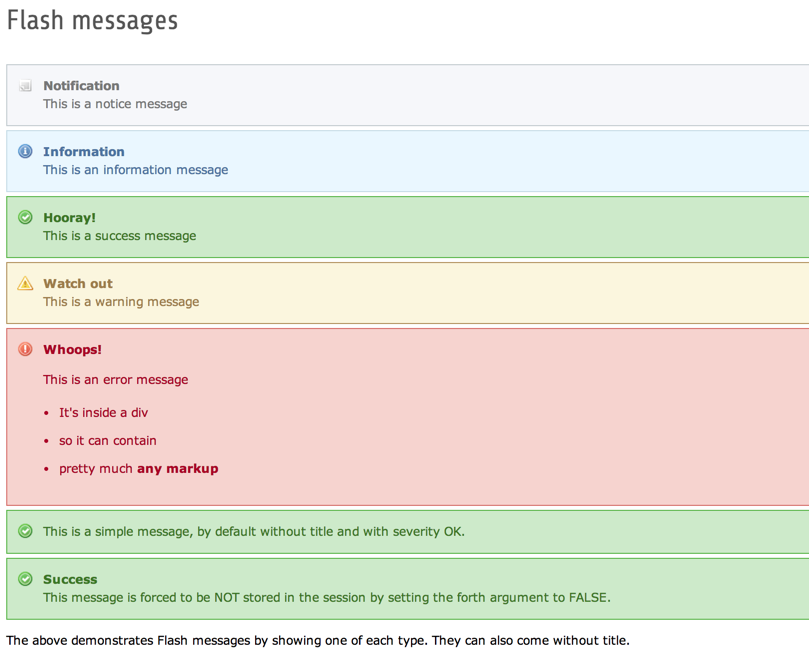

.. include:: /Includes.rst.txt
.. _demo-error-flash:

==============================
Demostración de mensajes Flash
==============================

The extension's BE module provide a screen for outputting Flash
messages. Code extracts are used in Core APIs.

